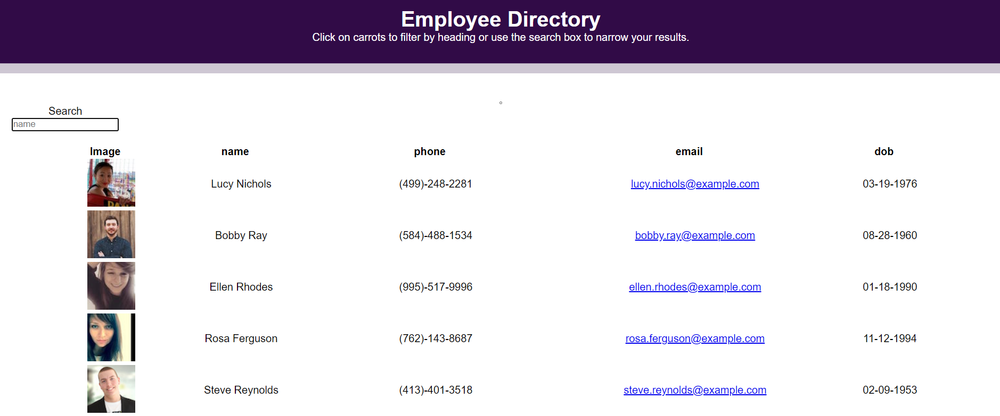

# Employee Directory

## Description

For this assignment, I had to create an employee directory with React. This assignment required me to break up the application's UI into components, manage component state, and respond to user events. Employee data was generated with the [randomuser.me API](https://randomuser.me).

## Table of Contents

* [Preview](#preview)

* [Usage](#usage)

* [License](#license)

## Preview

## Usage

* Clone/fork repo and install the necessary dependencies. Run the server with `npm start` and view application in your browser at `http://localhost:3000`.

## License

 

    

